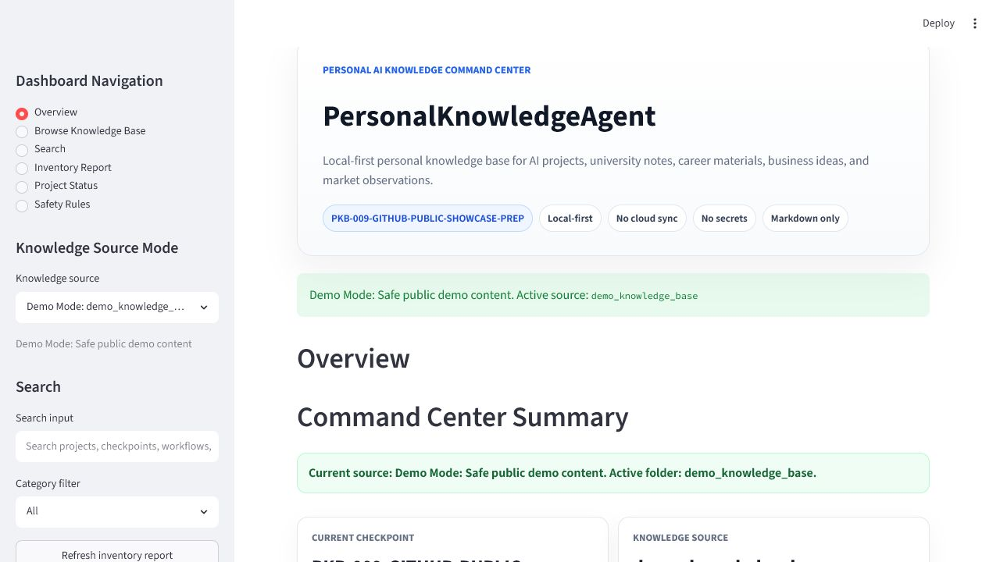
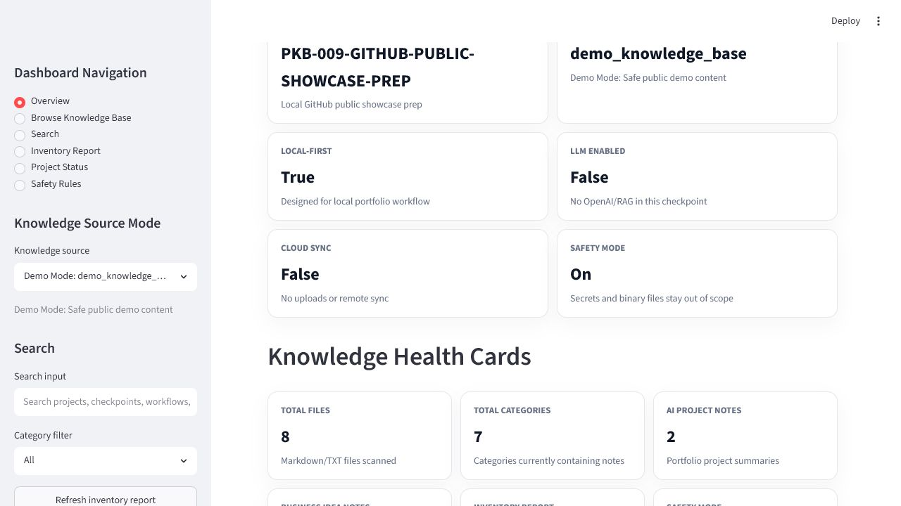
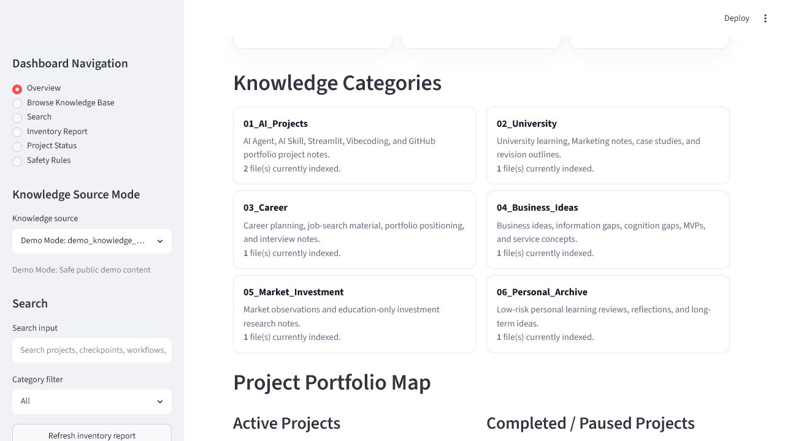
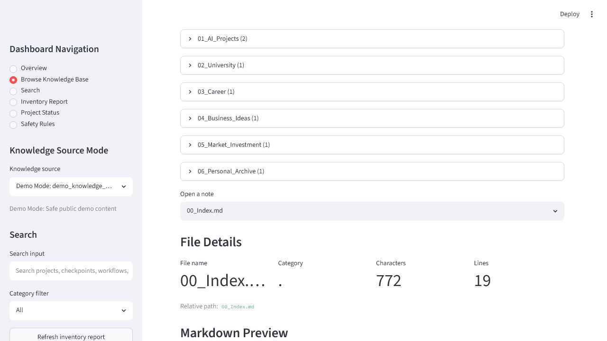
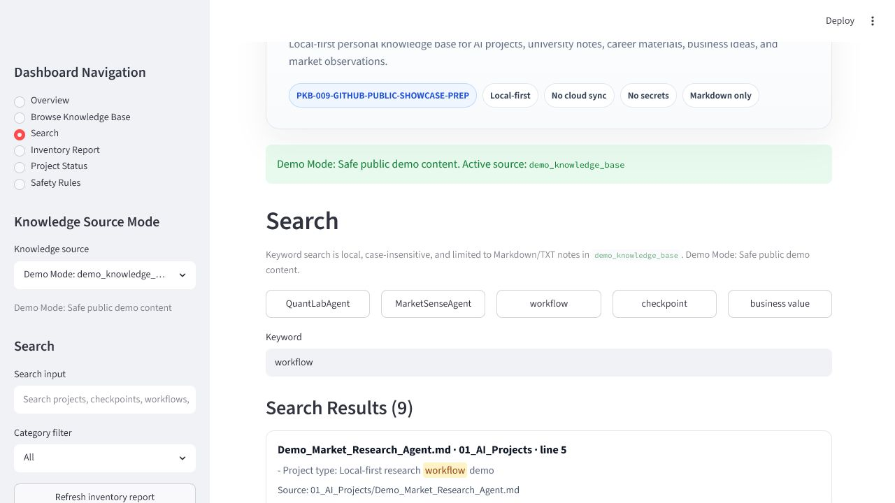
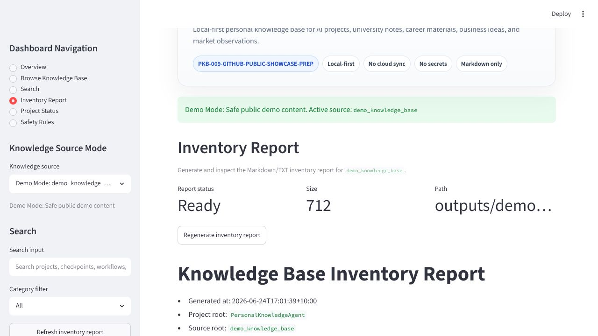
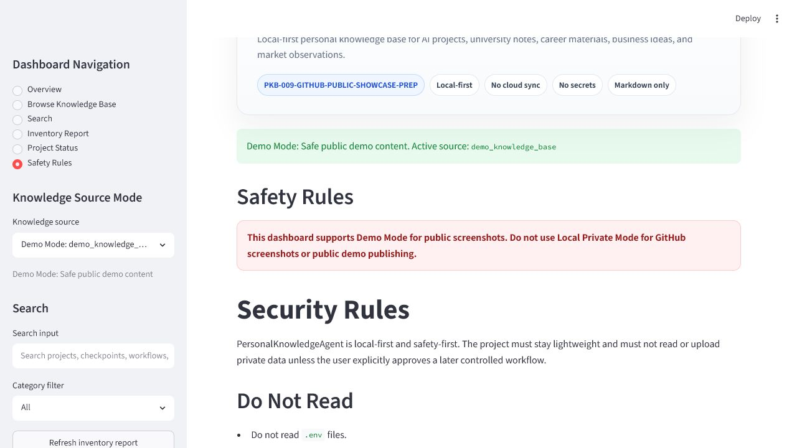
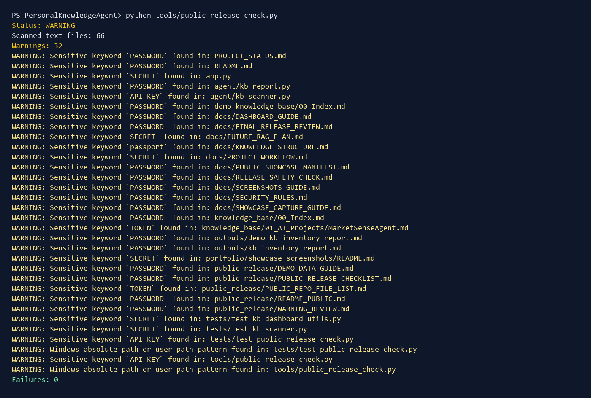

# PersonalKnowledgeAgent

PersonalKnowledgeAgent is a local-first, Markdown-first personal knowledge base agent for AI project notes, university learning material, career assets, business ideas, market observations, and future AgentHubControlCenter integration.

中文定位：个人知识库 Agent / 个人 AI 知识中台。

## Current Public Showcase Status

- Status: completed
- GitHub Profile Pin: not pinned for now
- Public version uses `demo_knowledge_base/` only for demo content
- Real private `knowledge_base/` content is excluded from the public showcase

## Why This Project Exists

This project is designed for a business and Marketing student building an AI Agent, AI Skill, Vibecoding, and GitHub portfolio system. The goal is not to build a complex RAG system in the first stages. The goal is to create a safe, structured, searchable local knowledge base that can gradually become the foundation for future AI workflow tools.

## Current Features

- Local `knowledge_base/` folder with 6 major knowledge categories.
- `knowledge_base/00_Index.md` as the current knowledge base index.
- Sanitized AI project summaries for the existing portfolio matrix.
- Markdown templates for future business and AI automation ideas.
- Streamlit local dashboard for browsing, searching, and checking project status.
- Lightweight local scanner for `.md` and `.txt` files.
- Keyword search with case-insensitive matching.
- Inventory report generator for local knowledge base files.
- Basic placeholder summary module for future RAG or LLM integration.
- Safety-first rules that avoid `.env`, token, key, password, binary, and generated output files.
- Pytest coverage for scanner, search, and inventory report behavior.

## PKB-002 Imported Project Notes

PKB-002 imports cleaned project summaries only. It does not import raw logs, credentials, private generated reports, private media, resumes, account data, or source files from other project folders.

Imported AI project summaries:

- MarketSenseAgent
- VideoExtractSkill
- QuantLabAgent
- SocialPainFinderAgent
- CareerPilotAgent
- NewsSignalAgent
- BusinessOpsAgent
- AgentHubControlCenter

Why only sanitized summaries:

- The knowledge base is intended to be searchable and GitHub-showcase-friendly.
- Full logs and private output files create privacy and security risk.
- Clean summaries are enough for portfolio navigation, project memory, and future dashboard integration.
- Sensitive details should remain outside public or semi-public documentation.

## AgentHubControlCenter Connection

PersonalKnowledgeAgent is designed to become the bottom knowledge layer for AgentHubControlCenter. A future stage can expose sanitized project summaries, project status, capability clusters, and report inventory data to the AgentHub dashboard.

This project is part of my local-first AI Agent portfolio and can be managed through [AgentHubControlCenter](https://github.com/CHENXJC/AgentHubControlCenter), the central command center for agent manifests, safe actions, useful signals, workflow simulations, connector readiness, approval gates, and public-safe reporting.

PersonalKnowledgeAgent is registered as a knowledge management module in AgentHubControlCenter.

The intended direction is:

```text
PersonalKnowledgeAgent -> sanitized project summaries -> AgentHubControlCenter dashboard
```

## PKB-003 Local Dashboard

PKB-003 adds a local Streamlit Dashboard. It is designed as a clean Apple-style command surface for browsing the personal knowledge base without connecting to APIs, cloud storage, or RAG.

Dashboard pages:

- Overview: project metrics, category descriptions, active projects, and paused projects.
- Browse Knowledge Base: category-based Markdown/TXT browsing with safe file reads.
- Search: local case-insensitive keyword search with example queries.
- Inventory Report: generate and inspect `outputs/kb_inventory_report.md`.
- Project Status: display the current `PROJECT_STATUS.md`.
- Safety Rules: display dashboard safety boundaries.

The dashboard only reads sanitized `.md` and `.txt` notes under `knowledge_base/` for knowledge browsing. It does not read `.env`, tokens, passwords, API keys, PDFs, Excel files, images, videos, or private identity documents.

## PKB-004 Dashboard Polish

PKB-004 improves the dashboard from a running local MVP into a stronger portfolio-ready product interface.

Product UI highlights:

- Cleaner Hero and Command Center Summary.
- Knowledge Health Cards for files, categories, report status, and safety mode.
- Project Portfolio Map with active and paused project cards.
- Improved Browse Knowledge Base page with category counts, file details, relative paths, and Markdown preview.
- Improved Search page with example query buttons, result count, result cards, and keyword highlighting.
- Inventory Report status cards.
- Safety-first dashboard warning surfaces.

Search UX improvements:

- Placeholder: `Search projects, checkpoints, workflows, business ideas...`
- Example searches: `QuantLabAgent`, `MarketSenseAgent`, `workflow`, `checkpoint`, `business value`
- Case-insensitive search through `agent.kb_search.search_knowledge_base`
- Basic highlight using local HTML mark tags

Public showcase preparation:

- Added `docs/SCREENSHOTS_GUIDE.md`
- Added `docs/PUBLIC_SHOWCASE_MANIFEST.md`
- The recommended next checkpoint is `PKB-005-PUBLIC-SHOWCASE-PREP` before any optional RAG work.

Safety-first local dashboard principle:

- The dashboard reads sanitized local Markdown/TXT notes only.
- It does not read secrets, credentials, private identity documents, PDFs, Excel files, images, or videos.
- It does not upload files, sync cloud storage, call OpenAI, initialize Git, create remotes, or push code.

## PKB-005 Showcase Preparation

PKB-005 prepares the project for a future GitHub public showcase without
publishing it yet.

Why the public version must use demo/sanitized notes:

- Personal knowledge base projects can contain private learning, career,
  business, market, and long-term planning material.
- Public repositories are easy to clone and hard to fully retract.
- Screenshots and inventory reports can expose sensitive file names even when
  the note body looks harmless.

Public showcase additions:

- `public_release/` with public release notes, checklist, demo data guide, and sample note style.
- `demo_knowledge_base/` with fictional Markdown notes for public screenshots and future demo mode.
- `tools/public_release_check.py` for blocking-risk and warning scans before publication.
- `docs/RELEASE_SAFETY_CHECK.md` explaining how to handle warning and failure output.

Run the public release safety check:

```powershell
python tools/public_release_check.py
```

Current public showcase rule:

- This project is local-first.
- The public showcase version should not include real private personal knowledge files.
- OpenAI/RAG integration is not included yet.
- Demo screenshots should use `demo_knowledge_base/` or manually reviewed sanitized notes only.

Future GitHub showcase plan:

1. Add demo mode or screenshot-safe configuration.
2. Capture screenshots using demo/sanitized content only.
3. Run the release safety checker.
4. Review all files intended for publication.
5. Only then decide whether to initialize Git and publish.

## PKB-006 Demo Mode and Screenshots

PKB-006 adds a dashboard Knowledge Source Mode selector for safer public
showcase preparation.

Available modes:

- Demo Mode: `demo_knowledge_base`
- Local Private Mode: `knowledge_base`

Demo Mode is the default and should be used for all GitHub screenshots and
public demo publishing. Local Private Mode is for local personal review only and
should not be used in public screenshots.

Launch the dashboard:

```powershell
streamlit run app.py --server.port 8521
```

Use Demo Mode:

1. Open the dashboard.
2. In the sidebar, confirm `Knowledge Source Mode` is set to `Demo Mode: demo_knowledge_base`.
3. Browse, search, and generate the inventory report from demo notes only.
4. Save reviewed screenshots to `portfolio/showcase_screenshots/`.

Screenshot preparation docs:

- `docs/SCREENSHOTS_GUIDE.md`
- `docs/SHOWCASE_CAPTURE_GUIDE.md`
- `portfolio/showcase_screenshots/README.md`

Public showcase safety warning:

- Do not publish real private personal knowledge files.
- Do not capture Local Private Mode for GitHub screenshots.
- Do not upload screenshots that reveal local absolute paths, tokens, passwords,
  API keys, credentials, identity documents, or private records.

Current RAG/OpenAI status: not included yet.

## PKB-007 Final Public Release Check

PKB-007 adds the final pre-publication release gate for a future GitHub public
showcase.

Public showcase status:

- Ready for final screenshot capture after PKB-007 validation.
- Not pushed to GitHub yet.
- Demo Mode remains the default public showcase mode.
- `demo_knowledge_base/` is the required source for public screenshots.
- Latest validation: 27 tests passed, compile checks passed, Demo Mode check
  passed, public release check returned 32 warnings and 0 failures.

Final validation commands:

```powershell
python -m pytest
python -m compileall agent
python -m py_compile app.py
python -m agent.kb_scanner
python -m agent.kb_search QuantLabAgent
python -m agent.kb_report
python tools/check_demo_mode.py
python tools/public_release_check.py
```

GitHub release note:

- Do not publish real private `knowledge_base/` content without review.
- Use `demo_knowledge_base/` for public screenshots.
- RAG/OpenAI integration is not included yet.
- Do not initialize Git, add a remote, or push until explicitly approved.

## Showcase Screenshots

The public showcase screenshot set was captured from the live Streamlit
dashboard using Demo Mode and `demo_knowledge_base/`, then refreshed during
PKB-009 so the dashboard checkpoint label matches the local release-prep state.

Screenshot safety status:

- Demo Mode is the default public showcase source.
- Screenshots use demo/sanitized Markdown notes only.
- Local Private Mode is not used in the screenshot set.
- GitHub Public Showcase has been published at
  `https://github.com/CHENXJC/PersonalKnowledgeAgent`.


















## PKB-009 GitHub Public Showcase Prep

PKB-009 prepares the local project for a future GitHub Public Showcase release.
It does not publish the repository, initialize Git, add a remote, or push code.

Public showcase policy:

- Real private `knowledge_base/` notes are excluded from the public showcase by
  default.
- The public demo source is `demo_knowledge_base/`.
- Public screenshots use Demo Mode and `demo_knowledge_base/` only.
- `outputs/` generated reports are local artifacts; only `outputs/.gitkeep`
  should be included.
- No OpenAI/RAG integration is included yet.
- No secrets, credentials, account details, or private records should be stored
  in this repository.

GitHub-ready local artifacts:

- Demo knowledge base: `demo_knowledge_base/`
- Showcase screenshots: `portfolio/showcase_screenshots/`
- Public release checklist and review docs: `public_release/`
- Safety and capture guides: `docs/`

## PKB-010 GitHub Public Showcase

PKB-010 publishes the project as a GitHub Public Showcase repository.

Repository:

```text
https://github.com/CHENXJC/PersonalKnowledgeAgent
```

Published boundary:

- Public branch: `main`
- Public demo source: `demo_knowledge_base/`
- Real private `knowledge_base/` notes: excluded by default
- Public knowledge base placeholder: `knowledge_base/README.md` and
  `knowledge_base/.gitkeep`
- Generated reports under `outputs/`: excluded except `outputs/.gitkeep`
- Screenshots: included under `portfolio/showcase_screenshots/`
- OpenAI/RAG integration: not included yet

## Project Structure

```text
PersonalKnowledgeAgent/
├─ knowledge_base/
│  ├─ README.md
│  └─ .gitkeep
├─ demo_knowledge_base/
├─ public_release/
├─ agent/
│  ├─ __init__.py
│  ├─ kb_dashboard_utils.py
│  ├─ kb_report.py
│  ├─ kb_scanner.py
│  ├─ kb_search.py
│  └─ kb_summary.py
├─ config/
│  └─ kb_config.json
├─ docs/
│  ├─ DASHBOARD_GUIDE.md
│  ├─ FUTURE_RAG_PLAN.md
│  ├─ KNOWLEDGE_STRUCTURE.md
│  ├─ PROJECT_WORKFLOW.md
│  ├─ PUBLIC_SHOWCASE_MANIFEST.md
│  ├─ SCREENSHOTS_GUIDE.md
│  ├─ SHOWCASE_CAPTURE_GUIDE.md
│  ├─ FINAL_RELEASE_REVIEW.md
│  ├─ RELEASE_SAFETY_CHECK.md
│  └─ SECURITY_RULES.md
├─ portfolio/
│  └─ showcase_screenshots/
├─ app.py
├─ tests/
├─ outputs/
├─ README.md
├─ PROJECT_STATUS.md
├─ requirements.txt
└─ .gitignore
```

## How to Run

```powershell
cd PersonalKnowledgeAgent
python -m pytest
python -m compileall agent
python -m agent.kb_scanner
python -m agent.kb_search QuantLabAgent
python -m agent.kb_report
python tools/check_demo_mode.py
python tools/public_release_check.py
```

The report command generates:

```text
outputs/kb_inventory_report.md
```

Start the local dashboard:

```powershell
streamlit run app.py
```

Optional fixed port:

```powershell
streamlit run app.py --server.port 8521
```

## Safety Boundary

- This project does not read `.env`, API keys, passwords, tokens, certificates, or credential files.
- This project does not upload private files.
- This project does not sync to cloud services.
- This project does not connect to OpenAI API or any paid API in PKB-004.
- This project does not scan other local project folders in PKB-004.
- The dashboard Browse page only opens `.md` and `.txt` files inside `knowledge_base/`.
- GitHub public versions must contain demo or sample content only.
- Public screenshots must use demo/sanitized notes only.
- Demo Mode is the default dashboard source for public showcase preparation.
- Local Private Mode must not be used for GitHub screenshots.
- Real private knowledge base files should not be published publicly.

## Roadmap

- `PKB-001`: Local knowledge base skeleton.
- `PKB-002`: Import sanitized project notes without secrets.
- `PKB-003`: Streamlit local dashboard.
- `PKB-004`: Dashboard polish and search UX.
- `PKB-005`: Public showcase prep with demo data and safety checker.
- `PKB-006`: Demo mode and screenshot readiness.
- `PKB-007`: Final public release check before any GitHub publishing decision.
- `PKB-008`: Screenshot capture using Demo Mode.
- `PKB-009`: GitHub public showcase prep with private `knowledge_base/` excluded by default.
- `PKB-010`: GitHub Public Showcase published.
- `PKB-011`: GitHub About/topics setup or GitHub Profile Pin decision.
- `PKB-012`: Showcase complete without profile pin; project paused.

## Disclaimer

This project is a local-first learning and portfolio project. It does not automatically upload private material, does not provide legal, immigration, financial, or investment advice, and should only be published publicly with demo/sample content.
